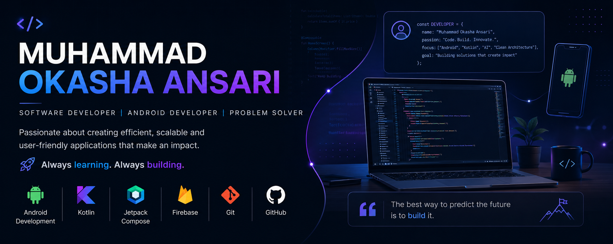

<h1 align="center">Hi 👋, I'm Muhammad Okasha Ansari</h1>

<h3 align="center">
Software Developer | Android Developer | Problem Solver
</h3>

Building applications, learning new technologies, and turning ideas into real-world solutions.

---

## 🚀 About Me

- 💻 Software & Android Developer
- 📱 Building Android applications with Kotlin
- 🎨 Working with Jetpack Compose
- 🔥 Exploring Firebase and modern development tools
- 🤖 Interested in AI-powered applications
- 🌱 Always learning and building new projects

---

## 🛠️ Technologies & Tools

---

## 📱 Featured Projects

### 📰 AI News Filter
An AI-powered Android application that filters and personalizes news based on user interests.

**Tech:** Kotlin • Jetpack Compose • Room • Retrofit • MVVM

### 🤖 AI Projects
Building intelligent applications and automation tools that solve real-world problems.

### 📱 Android Applications
Developing practical Android applications while exploring modern Android development.

---

## 📊 GitHub Stats

---

## 🤝 Let's Connect

---

### 💡 Always Learning. Always Building.

